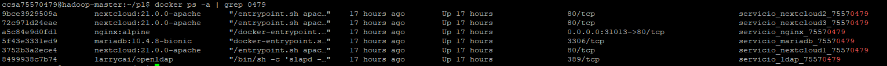

# Entrega de la primera práctica

> Ángel Gómez Martín - 75570479T - <agomezm@correo.ugr.es>

Esta es la estructura del directorio actual.

```bash
└───p1
    ├───hadoop
    └───scale
```

- **p1**: Contiene todos los archivos que se han creado y usado para desplegar los servicios de forma local. Los scripts _*.ps1_ los he creado pues en mi máquina local uso Windows.
- **hadoop**: Contiene una copia de los archivos del directorio raíz, pero con algunos cambios para acomodarlos a los requeridos a la hora de subirlos al servidor *hadoop.ugr.es*.
- **scale**: Contiene una copia de los archivos del directorio raíz, pero en lugar de usar instancias "estáticas" de NextCloud está pensado para utilizar la herramienta *--scale* de Docker. Además usa *Traefik* como balanceador de carga en lugar de *NGinx*.

## Despliegue en *hadoop.ugr.es*

El puerto asignado a mi DNI es el **31013**.

URL: <http://hadoop.ugr.es:31013>

Los contenedores que se han desplegado son:

- servicio_nextcloud1_75570479
- servicio_nextcloud2_75570479
- servicio_nextcloud3_75570479
- servicio_nginx_75570479
- servicio_mariadb_75570479
- servicio_ldap_75570479



## Usuarios disponibles:

- Usuario admin > U: admin, P: admin
- Usuario LDAP > U: angelgm, P: angelgm

---

## Preguntas - Cuestionario

### ¿Cuál sería el cuello de botella del sistema?

La base de datos, pues hay tres instancias de NextCloud que potencialmente podrían estar haciendo consultas a la BD al mismo tiempo y solo una instancia de MariaDB para responder esas consultas.

### ¿Qué ocurre si uno de los contenedores de NextCloud deja de funcionar? ¿Caería todo el sistema?

No caería todo el sistema. En mi caso hay tres intancias de NextCloud por lo que aún habría otras dos instancias que seguirían funcionando. Por otro lado todas las instancias de NextCloud están configuradas (en el archivo *docker-compose.yml*) para reiniciarse en caso de que suceda algún error, por lo que esta caída de un contenedor sería de algunos minutos.

### ¿Qué medidas tomarías para evitar sobrecargar el sistema por ejemplo lanzando varias decenas de contedores cuando el uso el sistema es mínimo?

El archivo *docker-compose.yml* que se ha creado no tiene las mejores prácticas a la hora de escalar contenedores, pues *hardcodea* todas las instancias que se quieren de cada uno de los servicios. Para evitar sobrecargar el sistema optaría por utilizar otras tecnologías, como Docker Swarm o Kubernetes, las cuales permiten escalar los diferentes servicios de manera automática en función de la carga que están sufriendo estos. En esta entrega se adjunta también (en el directorio */scale*) otro archivo *docker-compose.yml*, el cual solo define una instancia de NextCloud pero que puede escalarse usandose la orden *--scale* de Docker. De este modo se podrían crear tantas instancias como fuesen necesarias. (Además, se ha usado *Traefik* como balanceador de carga).

#### ¿Qué directivas tomarías si la demanda de uso del sistema crece, qué microservicios deberías tener en cuenta?

Implementaría el despliegue con Docker Swarm o Kubernetes, y los servicios de NextCloud, base de datos y LDAP serían los que se configurarían para escalar en mayor medida en caso de una demanda excesiva del sistema.

#### ¿Y si se cae la instancia de MySQL, qué ocurriría?, ¿Cómo solucionarías el problema?

En la configuración actual si cae el servicio de base de datos se cae el sistema por completo, pues (salvo LDAP y NGinx) todos los servicios dependen de él. Sería necesario crear otros contenedores o escalar el actual.